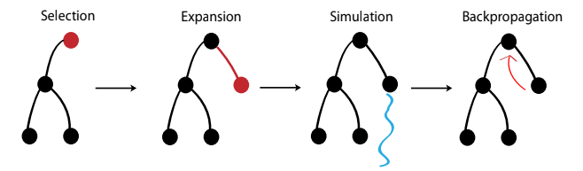

# Bothello

Bothello is a GPU accelerated Othello engine that uses Monte Carlo Tree Search (MCTS) algorithm in order to improve its
gameplay.

  

\*Image source: [Large-Scale Parallel Monte Carlo Tree Search on GPU](https://ieeexplore.ieee.org/document/6009083)

### Steps:

- **Selection**: you traverse the tree from the root, selecting the best child node at each step using the UCT
  algorithm. You repeat this until you reach a node that has unexplored moves (not fully expanded)
    - you have to chose the child with the highest UCT value
    - $UCT_i = \frac{w_i}{n_i} + c \sqrt{\frac{ln{N}}{n_i}}$
        - $w_i$ win count of child node
        - $n_i$ visit count of child node
        - $N$ visit count of current (parent) node
        - $c$ exploration constant, usually $\sqrt{2}$ is used
- **Expansion**: when you reach the leaf, you can randomly pick one of the unvisited legal moves and create a new node
  for that
- **Simulation (Rollout)**: From the newly created node, the algorithm performs a simulation to estimate the value of
  the state. **Random Rollout** (Classic MCTS): The algorithm plays random moves (sometimes weighted by simple
  heuristics)
  until a terminal state (win, loss, or draw) is reached
- **Backpropagation**: The result of the simulation is propagated back up to the root. You must traverse the exact path
  taken during the **Selection phase** and update the statistics for each node visited:
    - $N$ (Visits): Incremented by 1 for all nodes in the path
    - $w$ (Wins): Updated based on who won the simulation

Repeat the above steps for a predefined number of iterations or until a time limit is reached.
